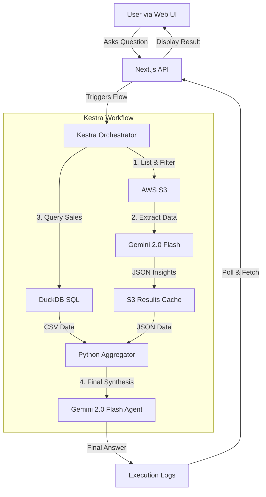

-----

# 🏭 ScrapIntel Agent: Industrial Intelligence Pipeline

> **An Autonomous AI Agent that fuses unstructured PDF reports and structured Sales Data to forecast metal recycling trends.**

## 💡 The Problem

The automotive recycling industry operates on fragmented data. Sales figures live in CSV databases, while critical vehicle lifespan and curb weight statistics are locked inside static industry PDF reports. Answering a simple question like *"How much scrap steel will Florida produce in 2024?"* typically requires hours of manual cross-referencing.

## 🚀 The Solution

**ScrapIntel Agent** is an orchestrated AI pipeline built with **Kestra** and **Google Gemini 2.0**. It autonomously:

1.  **Reads & Understands** complex PDF reports (extracting vehicle lifespan/weight stats).
2.  **Queries** massive sales datasets using **DuckDB**.
3.  **Synthesizes** intelligence to answer complex, user-defined questions in real-time.
4.  **Delivers** answers via a custom React/Next.js Web UI.

## 🛠️ Architecture

The system follows a **Hybrid Agentic Architecture**:



## ✨ Key Features

  * **Dynamic Querying:** The agent isn't hardcoded. It adapts its analysis based on the specific question asked by the user.
  * **Smart Caching:** Expensive PDF analysis is cached in S3. If a report hasn't changed, the agent skips re-processing, saving time and API costs.
  * **Multi-Modal RAG:** Seamlessly joins unstructured text/tables from PDFs with structured SQL data.
  * **Persistent Deployment:** Dockerized setup ensures data and flow persistence across restarts.

## 🔧 Tech Stack

  * **Orchestration:** [Kestra](https://kestra.io)
  * **LLM Intelligence:** Google Gemini 2.0 Flash & Flash-Lite
  * **Data Processing:** DuckDB & Pandas
  * **Storage:** AWS S3
  * **Frontend:** Next.js (React) & Tailwind CSS

-----

## 🏃‍♂️ Setup & Installation

### 1\. Prerequisites

  * Docker & Docker Compose installed.
  * An AWS S3 bucket with your vehicle PDF reports.
  * A Google Gemini API Key.
  * Node.js (for the frontend).

### 2\. Secret Management

To keep API keys secure and compatible with Kestra's environment injection, we encode them into a `.env_encoded` file.

1.  Create a standard `.env` file in the root directory:

    ```env
    AWS_ACCESS_KEY_ID=your_key
    AWS_SECRET_ACCESS_KEY=your_secret
    GEMINI_API_KEY=your_gemini_key
    ```

2.  Run the provided helper script to encode secrets:

    ```bash
    # Make the script executable
    chmod +x encode_secrets.sh

    # Run it to generate .env_encoded
    ./encode_secrets.sh
    ```

    *(The script reads `.env`, base64 encodes the values, and outputs to `.env_encoded`)*

### 3\. Start Kestra (Backend)

We use a custom `docker-compose.yml` configuration to ensure Kestra's internal Postgres database and storage are persistent.

```bash
docker-compose up -d
```

  * Access the Kestra UI at `http://localhost:8080`.
  * Import the `scrap-intel-pipeline.yaml` flow from this repository into Kestra.

### 4\. Start the Web UI (Frontend)

Navigate to the UI directory and start the Next.js dashboard.

```bash
cd ui
npm install
npm run dev
```

  * Open your browser to `http://localhost:3000`.

-----

## 📸 Usage

1.  Open the Web UI.
2.  Type a question (e.g., *"Calculate the total scrap metal potential for Florida and California in 2024"*).
3.  The Agent will trigger the Kestra pipeline, analyze the documents, and stream the answer back to your dashboard in real-time.

## 📄 License

MIT License